

<h1>osTicket - Prerequisites and Installation</h1>
This tutorial outlines the prerequisites and installation of the open-source help desk ticketing system osTicket. 

<h2>Environments and Technologies Used</h2>

- Microsoft Azure (Virtual Machines/Compute)
- Remote Desktop
- Internet Information Services (IIS)

<h2>Operating Systems Used </h2>

- Windows 10</b> (21H2)

<h2>List of Prerequisites</h2>

- PHP Manager For IIS
- Rewrite_amd64_en-US.msi
- php-7.3.8-nts-Win32-VC15-x86.zip
- VC_redist.x86.exe
- My SQL 5.5.62
- OS Ticket v1.15.8
- HeidiSQL

<h2>Installation Steps</h2>

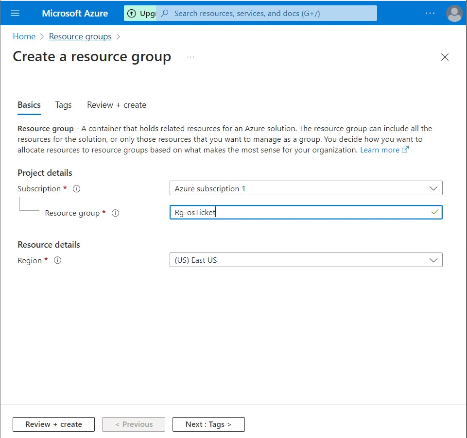

Step 1. Create a Resource Group in Azure

 

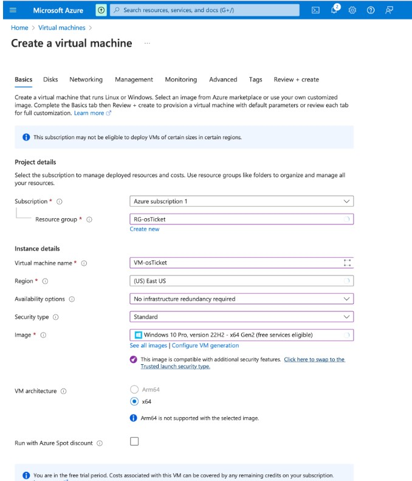

Step 2. Create a Windows 10 pro Virtual Machine (VM) with 2-4 Virtual CPUs

- Name: VM-osTicket
- Username: labuser (or what ever you decide to choose for a username)
- Password: osTicketPassword1!(example)
- When creating the VM, Create a new Virtual Network (Vnet)
- Click Review+Create

 

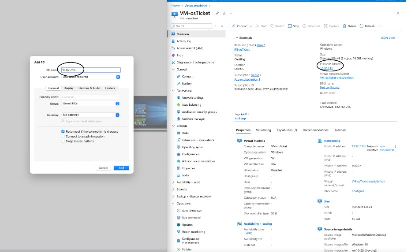 

Step 3. Open Microsoft Remote Desktop (If on Mac Desktop)

- Click Add PC and enter your VMs public IP (Wait until the VM finishes deploying)
- Enter the username and password you put in for your VM

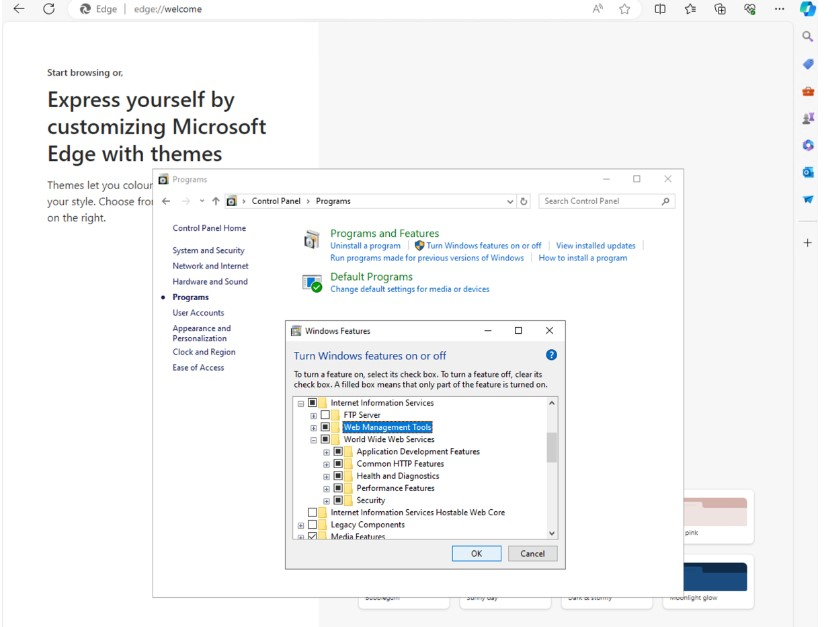

Step 4: Install/Enable IIS in Windows with CGI and Common HTTP features

- Right click on the "start" icon, Click run, and enter "control"
- Click on "programs" and then "turn windows features on or off"
- Click on internet information services -> World Wide Web Services -> Application Development Features -> [X] CGI [X] Common HTTP Features
- Internet Information Services -> Web Management Tools -> IIS Management Console [X] IIS Management Console
- Click Ok

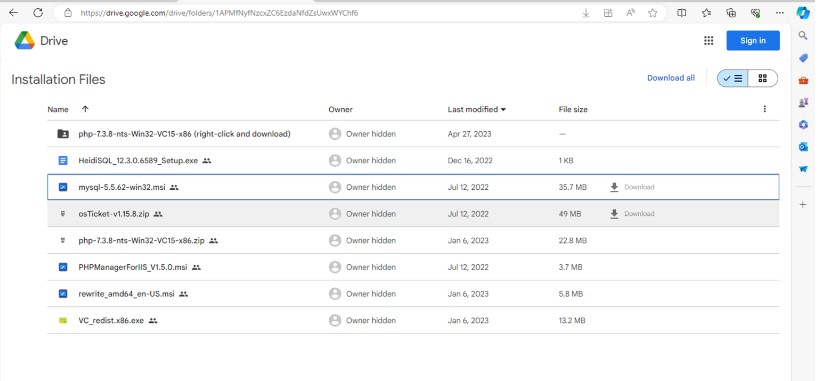

Step 5. Open the Installation files page here: (https://drive.google.com/drive/u/1/folders/1APMfNyfNzcxZC6EzdaNfdZsUwxWYChf6)

- Download and isntall PHP Manager for IIS
- Download and install Rewrite Module
- Download and install PHP 7.3.8
- Download and install VC_redist.x86.exe.
- Download and install MySQL 5.5.62 When MySQL downloads: Typical setup -> Launch Configuration Wizard(after install) -> Standard Configuration -> Password1 -> Execute
  
Note: if you dont see anything happen immediately after clicking download, give it a few seconds.

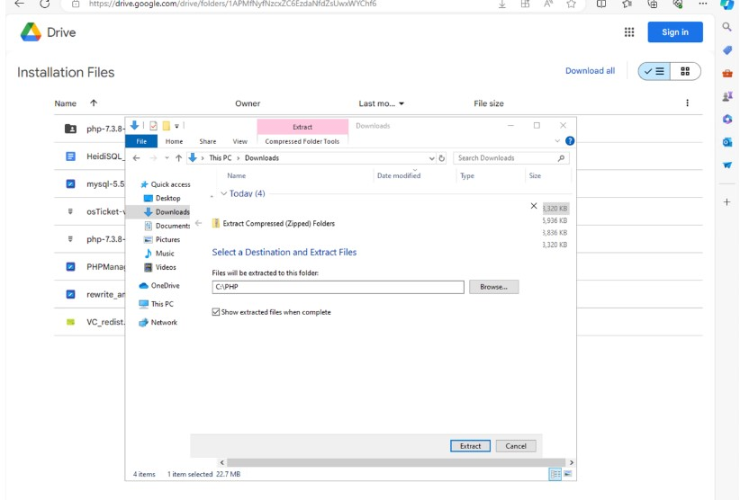

When PHP 7.3.8 is finished downloading, Create a folder "PHP" on Windows (C:). right click the PHP 7.3.8 file -> extract all -> browse -> This PC -> Windows (C:) -> PHP -> Select Folder -> Extract

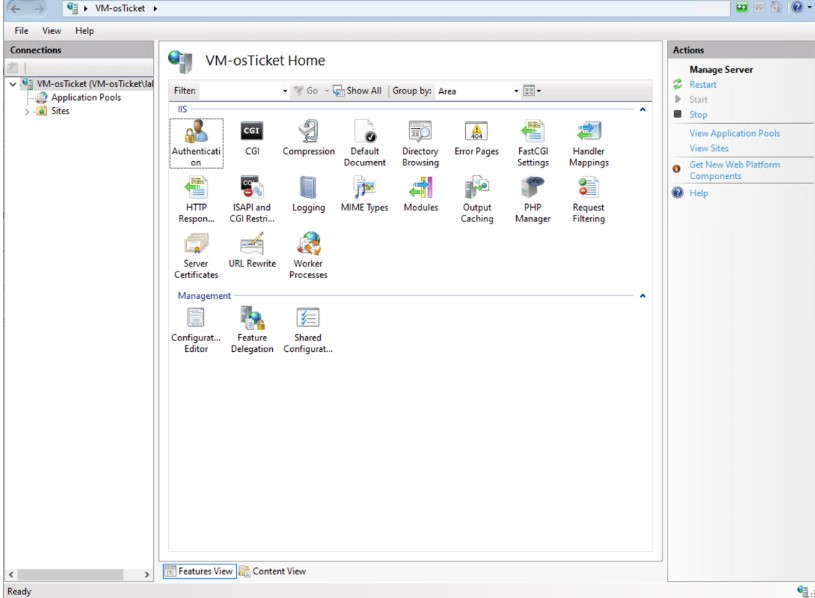

Step 6. Open IIS as an Admin

- On the search bar type IIS -> right click on IIS and click "run as administrator"
- Register PHP from within IIS
- Click on PHP Manager -> Register new PHP version -> "..." -> this PC -> PHP -> php-cgi -> open
- Go back to the home page and click "Restart"

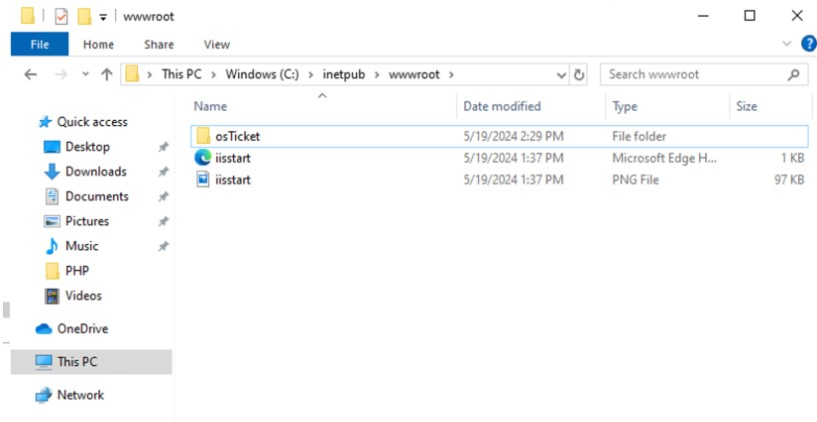

Step 7. Download and Install osTicket v1.15.8

- When downloaded, open the osTicket file
- Once inside the folder, open another file explorer and go to This PC -> Windows (C:) -> inetpub -> wwwroot
- On the wwwroot folder, drag the "upload" folder to the "wwwroot" folder
- Rename the "upload" folder to "osTicket

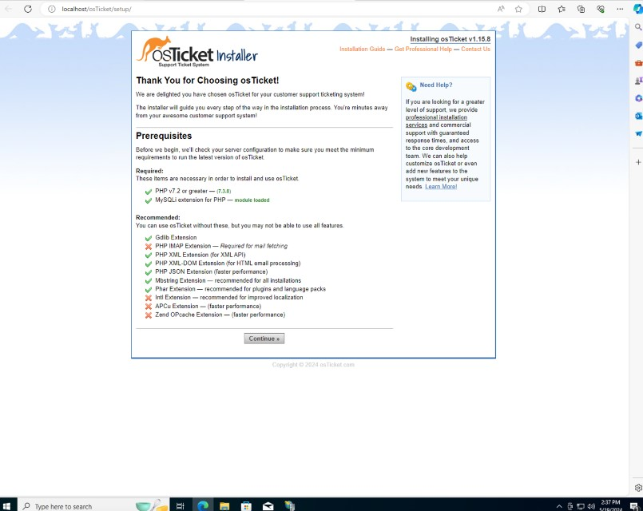

Step 8. Go back to IIS Manager

- Click restart
- Go to sites -> Default -> osTicket
- On the right, click "Browse *:80"
- When click on that, you should see it opening the webpage shown on the image.
  
Note: if you dont see this and instead an error page, something was done wrong.

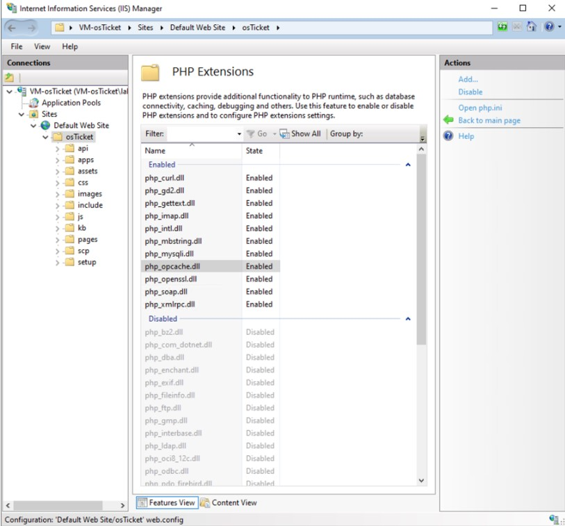

Step 9. Some extensions are not enabled.

- Go back to IIS -> sites -> Default -> osTicket
- Double click PHP Manager
- Click "Enable or Disable an extension" Enable: php_imap.dll Enable: php_intl.dll Enable: php_opcache.dll

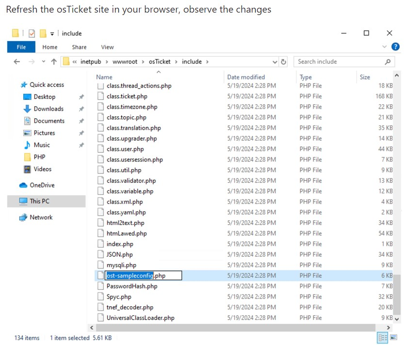

Step 10. Rename: ost-config.php

- Go to the wwwroot folder
- click on osTicket -> include
- look for the file "ost-sampleconfig.php and rename it to "ost-config.php"
- Right click ost-config.php -> Properties -> Security -> Advance -> Disable inheritance -> Remove all -> Add -> Select Principle -> type "Everyone" -> Ok -> click "Full Controll" -> ok -> Apply and then OK

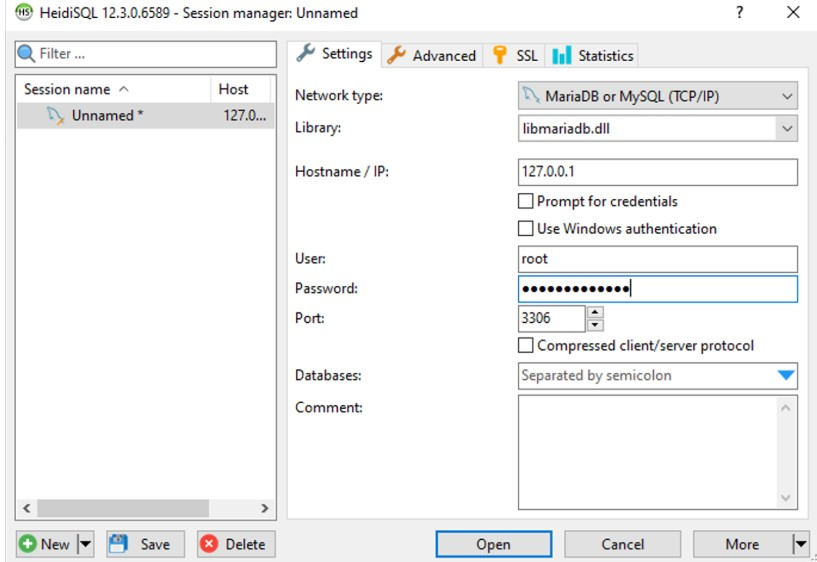

Step 11. Download and Install HeidiSQL

- Open HeidiSQL
- Create a new session, root/Password1
- Connect to the session
- Create a database called "osTicket"

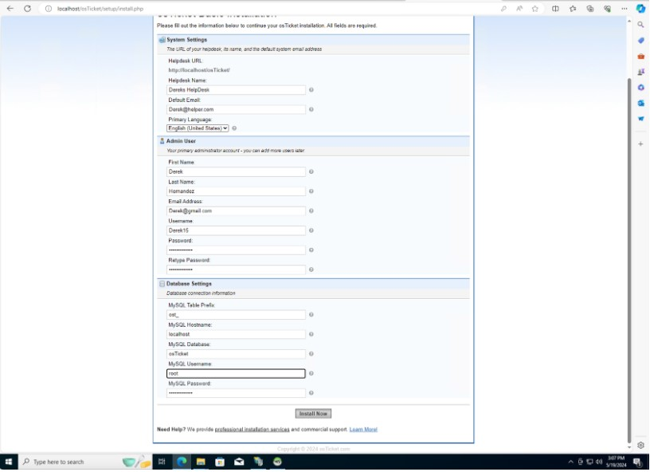

Step 11. Continue Setting up Osticket in the browser

- Name HelpDesk
- Derek@helper.com (receives email from customers)
- MySQL Database: osTicket
- MySQL Username: root
- MySQL Password: Password1
- Click "Install Now!"

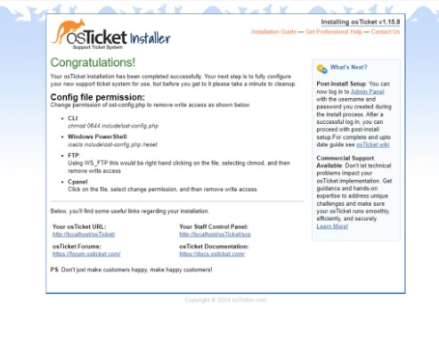

"Congratulations"

Clean up

- Delete: C:\inetpub\wwwroot\osTicket\setup
- Set Permissions to “Read” only: C:\inetpub\wwwroot\osTicket\include\ost-config.php

 
